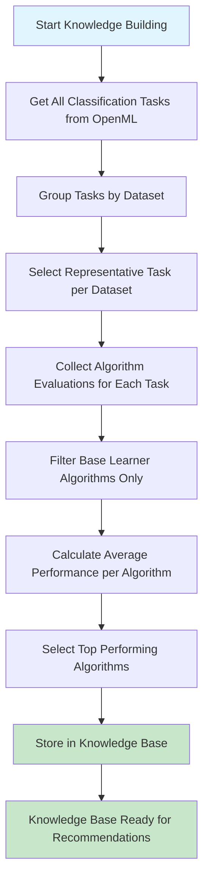

# Knowledge Builder Service Documentation

## Overview

The Knowledge Builder Service automatically collects machine learning performance data from OpenML to build a knowledge base of which algorithms work best on different datasets.

## What is OpenML?

OpenML is a public platform where researchers share machine learning datasets, algorithms, and their performance results.

## Key Concepts Explained

### 📊 Datasets
Collections of data representing real-world problems (medical records, financial transactions, etc.)

### 🎯 Tasks
Specific machine learning challenges linked to datasets (e.g., "classify emails as spam/not spam")

### 🤖 Algorithms (Flows)
Different machine learning methods like decision trees, neural networks, or support vector machines

### 📈 Evaluations/Runs
Performance results when algorithms run on datasets, producing accuracy scores and other metrics

### 🏆 Metrics
Performance measures including:
- **Primary**: `area_under_roc_curve` (main success measure)
- **Additional**: `predictive_accuracy`

## How the Knowledge Builder Works

### Data Collection Process

### Step-by-Step Process

1. **🔍 Discovery Phase**
   - Connects to OpenML and finds all classification tasks
   - Groups tasks by their underlying datasets
   - Selects the most representative task for each dataset (the one with the most algorithm evaluations)

2. **📊 Data Collection Phase**
   - For each selected task, collects performance evaluations for all metrics
   - Downloads results from hundreds or thousands of algorithm runs
   - Focuses only on "base learner" algorithms (simple, fundamental methods)

3. **🧹 Data Cleaning Phase**
   - Filters out complex algorithms and pipelines
   - Keeps only core machine learning algorithms from scikit-learn
   - Removes incomplete or invalid results

4. **📈 Performance Analysis Phase**
   - Calculates average performance for each algorithm on each dataset
   - Groups algorithms by family (e.g., all tree-based methods together)
   - Identifies the best-performing algorithm for each dataset

5. **💾 Storage Phase**
   - Stores the top-performing algorithms and their metrics
   - Creates entries with dataset information and performance scores
   - Builds a searchable knowledge base for future recommendations

## Algorithm Categories

The system focuses on these types of machine learning algorithms:

### 🌳 **Tree-Based Methods**
- Decision Trees: Simple, interpretable rules
- Random Forests: Combines many trees for better accuracy
- Gradient Boosting: Iteratively improves predictions

### 📊 **Statistical Methods**  
- Logistic Regression: Uses statistics to make predictions
- Naive Bayes: Assumes features are independent
- Discriminant Analysis: Finds optimal separation boundaries

### 🔍 **Distance-Based Methods**
- K-Nearest Neighbors: Looks at similar examples
- Support Vector Machines: Finds optimal decision boundaries

### 🧠 **Neural Networks**
- Multi-Layer Perceptrons: Simple neural networks

## Configuration Options

### 📏 **Quality Controls**
- **Minimum Algorithms**: Requires at least 5 different algorithms per dataset
- **Top N Storage**: Stores only the best-performing algorithms (configurable)
- **Base Learners Only**: Excludes complex pipelines and ensemble methods

### 🎛️ **Customizable Parameters**
- **Primary Metric**: Which performance measure to optimize for
- **Extra Metrics**: Additional performance measures to track
- **Dataset Limit**: How many datasets to process (for faster testing)
- **Include Ensembles**: Whether to include ensemble methods

## Output and Benefits

### 📈 **Knowledge Base Contents**
Each entry contains:
- Dataset information (name, ID, characteristics)
- Algorithm details (name, family, configuration)
- Performance metrics (accuracy, ROC curve, etc.)
- Task and run identifiers for traceability

### 🎯 **Use Cases**
1. **Algorithm Recommendation**: Suggest best algorithms for new datasets
2. **Performance Benchmarking**: Compare algorithm performance across domains
3. **Meta-Learning**: Learn patterns about which algorithms work where
4. **Research Insights**: Identify trends in machine learning performance

## Technical Implementation Notes

- Uses retry logic to handle OpenML API reliability issues
- Processes data in batches to manage memory usage
- Implements filtering to focus on scientifically relevant algorithms
- Provides logging and error handling for production use

This knowledge base becomes the foundation for intelligent algorithm selection, helping users choose the best machine learning approach for their specific data and problem type.
